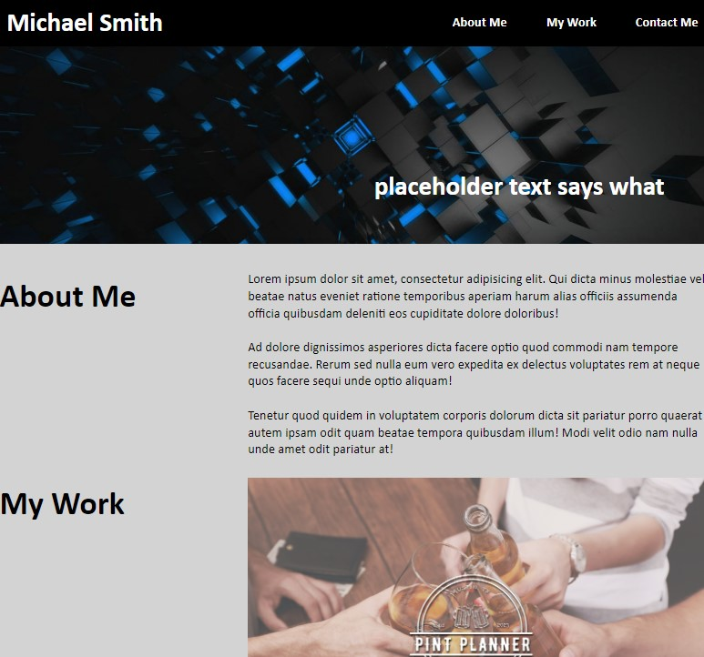

# Advanced CSS Challenge: Professional Portfolio

## Description

This is the second challenge for the UT Coding Bootcamp and focuses on the use of CSS to create a portfolio.

I have been doing my best to fall in love with CSS, but alas, it was not meant to be. 

Future Updates: _Rework this entire thing_.

## Table of Contents 

- [Installation](#installation)
- [Usage](#usage)
- [Credits](#credits)
- [License](#license)

## Installation

Visit my portfolio at: [https://austinbq02.github.io/UTCB-Challenge-02/](https://austinbq02.github.io/UTCB-Challenge-02/)

## Usage

- Navigate to the website above.
- Click the links in the navigation bar to automatically scroll to the listed section.
- Click on any of the images to go to the indicated project.

## Credits

Full Stack Blog - [Professional README Guide](https://coding-boot-camp.github.io/full-stack/github/professional-readme-guide)

UT Coding Boot Camp - Module 2 Activity 25 _(class repo is private)_
- [public profile](https://github.com/the-Coding-Boot-Camp-at-UT) 

Free Web Headers -[terms of use](https://www.freewebheaders.com/terms-of-use/)

[w3schools.com](w3schools.com)

Kevin Powell - _making me hate CSS a little less_
- [YouTube](https://www.youtube.com/@KevinPowell)
- [GitHub](https://github.com/kevin-powell/learn-grid-the-easy-way)

## License

Please see LICENSE file. 

---

